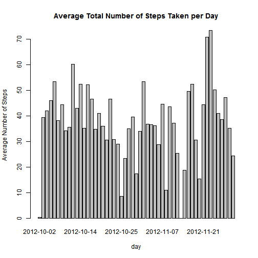

Loading and preprocessing the data and necessary package

```r
library(knitr)
activity <- "./activity.csv"
activity_data <- read.table(activity, header=TRUE, sep=",", stringsAsFactors=FALSE, dec=".")
```

```
## Warning in file(file, "rt"): cannot open file './activity.csv': No such
## file or directory
```

```
## Error in file(file, "rt"): cannot open the connection
```

```r
activity_data$date <- as.Date(activity_data$date, "%Y-%m-%d")
```

Mean total number of steps taken per day


```r
MeanByDay <- aggregate(steps ~ date, activity_data, mean)
barplot(height=MeanByDay$steps, names.arg=MeanByDay$date, xlab="day", ylab="Average Number of Steps",main="Average Total Number of Steps Taken per Day")
```

 

Sum, mean, median number of steps taken per day


```r
SumByDay <- aggregate(steps ~ date, activity_data, sum)
barplot(height=SumByDay$steps, names.arg=SumByDay$date, xlab="day", ylab="Median Number of Steps",main="Total Number of Steps Taken per Day",col="blue")
mean(SumByDay$steps)
```

```
## [1] 10766.19
```

```r
median(SumByDay$steps)
```

```
## [1] 10765
```

```r
max_steps <- max(activity_data$steps,na.rm=TRUE)

abline(h=mean(SumByDay$steps, na.rm=TRUE), col="orange", lwd=2)
abline(h=median(SumByDay$steps, na.rm=TRUE), col="black", lwd=2)
```

 
Return interval with maximum steps

```r
na.omit(activity_data[activity_data$steps==max(activity_data$steps,na.rm=TRUE),])
```

```
##       steps       date interval
## 16492   806 2012-11-27      615
```


Rows with NA

```r
sum(is.na(activity_data))
```

```
## [1] 2304
```

Replace NA with Mean

```r
MeanByInterval <- aggregate(steps ~ interval, activity_data, mean)
actMerge <- merge(activity_data, MeanByInterval, by="interval", suffixes=c(".act", ".mn"))
act_mss_rep<-activity_data
act_mss_rep[which(is.na(act_mss_rep$steps)),"steps"] <- actMerge[which(is.na(act_mss_rep$steps)),"steps.mn"]
```

Sum, mean, median number of steps taken per day - Non-Missing Steps


```r
SumByDayNoMss <- aggregate(steps ~ date, act_mss_rep, sum)
barplot(height=SumByDayNoMss$steps, names.arg=SumByDayNoMss$date, xlab="day", ylab="Median Number of Steps",main="Total Number of Steps Taken per Day (Non-Missing Steps)",col="blue")
mean(SumByDayNoMss$steps)
```

```
## [1] 10889.8
```

```r
median(SumByDayNoMss$steps)
```

```
## [1] 11015
```

```r
abline(h=mean(SumByDayNoMss$steps, na.rm=TRUE), col="orange", lwd=2)
abline(h=median(SumByDayNoMss$steps, na.rm=TRUE), col="black", lwd=2)
```

 

Steps by Interval - Weekday vs Weekend

```r
act_mss_rep$weekdays <-weekdays(act_mss_rep$date)
MeanByIntNoMssWknd <- aggregate(steps ~ interval, act_mss_rep[act_mss_rep$weekdays %in% c("Saturday","Sunday"),], mean)
MeanByIntNoMssWkdy <- aggregate(steps ~ interval, act_mss_rep[!(act_mss_rep$weekdays %in% c("Saturday","Sunday")),], mean)

par(mfrow=c(2,1))
plot(MeanByIntNoMssWknd$interval, MeanByIntNoMssWknd$steps, type="l", col="orange",main="Weekend",xlab="Interval",ylab="Average Num of Steps")
plot(MeanByIntNoMssWkdy$interval, MeanByIntNoMssWkdy$steps, type="l", col="black",main="Weekday",xlab="Interval",ylab="Average Num of Steps")
```

 
